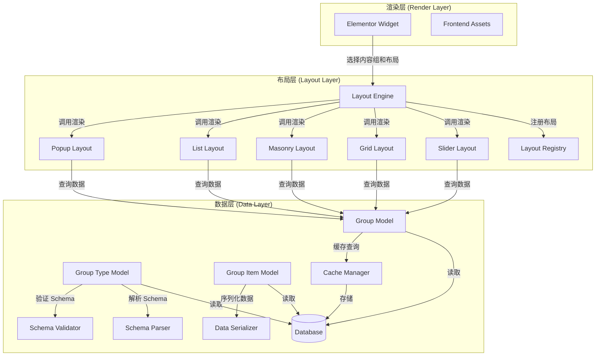
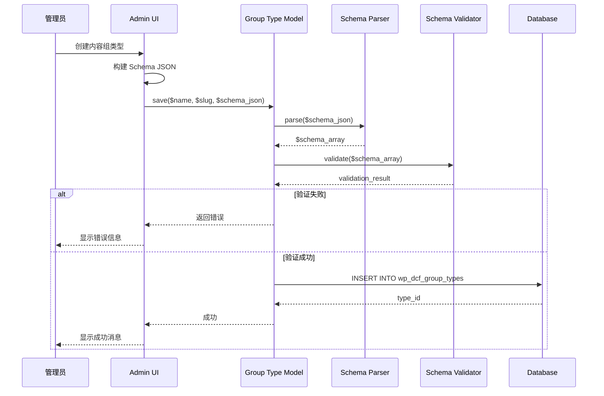
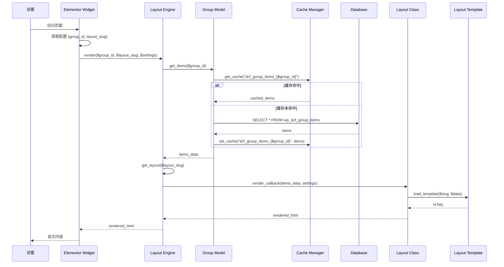
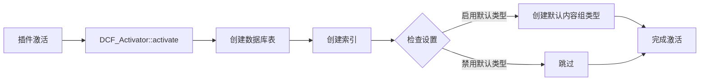
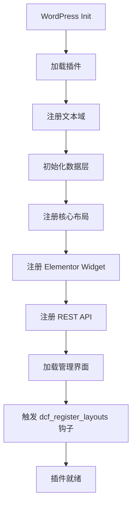
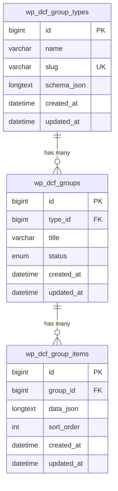

# Design Document: Elementor Dynamic Content Framework

## Overview

Elementor Dynamic Content Framework 是一个企业级 WordPress 插件，通过三层架构（数据层/布局层/渲染层）实现完全解耦的动态内容管理系统。插件深度集成 Elementor 页面构建器，通过单一通用组件支持无限扩展的内容类型和布局方式。

### 核心设计理念

1. **三层架构分离**: 数据存储、布局渲染、UI 展示完全解耦
2. **Schema 驱动**: 通过 JSON Schema 定义灵活的字段结构
3. **可插拔布局**: 布局引擎支持动态注册和扩展
4. **单一通用组件**: 一个 Elementor Widget 处理所有内容类型
5. **性能优先**: 多层缓存策略和按需加载资源

### 技术栈

- **WordPress**: 6.0+
- **Elementor**: 3.0+
- **PHP**: 7.4+
- **Database**: MySQL 5.7+ / MariaDB 10.3+
- **Frontend**: Vanilla JavaScript (ES6+), CSS3
- **Slider Library**: Swiper.js 8.x

### 插件目录结构

```
wp-content/plugins/elementor-dynamic-content-framework/
├── elementor-dynamic-content-framework.php  # 主插件文件
├── includes/
│   ├── class-dcf-activator.php              # 激活处理
│   ├── class-dcf-deactivator.php            # 停用处理
│   ├── class-dcf-loader.php                 # 钩子加载器
│   ├── class-dcf-i18n.php                   # 国际化
│   │
│   ├── database/
│   │   ├── class-dcf-database.php           # 数据库管理器
│   │   ├── class-dcf-schema-parser.php      # Schema 解析器
│   │   ├── class-dcf-schema-validator.php   # Schema 验证器
│   │   ├── class-dcf-schema-printer.php     # Schema 序列化器
│   │   ├── class-dcf-data-serializer.php    # 数据序列化器
│   │   └── class-dcf-query-builder.php      # 查询构建器
│   │
│   ├── models/
│   │   ├── class-dcf-group-type.php         # 内容组类型模型
│   │   ├── class-dcf-group.php              # 内容组模型
│   │   └── class-dcf-group-item.php         # 内容项模型
│   │
│   ├── layouts/
│   │   ├── class-dcf-layout-engine.php      # 布局引擎
│   │   ├── class-dcf-layout-registry.php    # 布局注册表
│   │   ├── layouts/
│   │   │   ├── class-dcf-slider-layout.php  # 轮播布局
│   │   │   ├── class-dcf-grid-layout.php    # 网格布局
│   │   │   ├── class-dcf-masonry-layout.php # 瀑布流布局
│   │   │   ├── class-dcf-list-layout.php    # 列表布局
│   │   │   └── class-dcf-popup-layout.php   # 弹窗布局
│   │   └── templates/
│   │       ├── slider.php                   # 轮播模板
│   │       ├── grid.php                     # 网格模板
│   │       ├── masonry.php                  # 瀑布流模板
│   │       ├── list.php                     # 列表模板
│   │       └── popup.php                    # 弹窗模板
│   │
│   ├── widgets/
│   │   └── class-dcf-elementor-widget.php   # Elementor 动态组件
│   │
│   ├── admin/
│   │   ├── class-dcf-admin.php              # 管理界面主类
│   │   ├── class-dcf-admin-menu.php         # 菜单管理
│   │   ├── class-dcf-group-type-list.php    # 类型列表页
│   │   ├── class-dcf-group-type-editor.php  # 类型编辑器
│   │   ├── class-dcf-group-list.php         # 内容组列表页
│   │   ├── class-dcf-group-editor.php       # 内容组编辑器
│   │   ├── class-dcf-item-editor.php        # 内容项编辑器
│   │   ├── class-dcf-settings.php           # 设置页面
│   │   ├── class-dcf-import-export.php      # 导入导出
│   │   └── class-dcf-system-status.php      # 系统状态
│   │
│   ├── api/
│   │   ├── class-dcf-rest-api.php           # REST API 控制器
│   │   ├── class-dcf-rest-group-types.php   # 类型端点
│   │   ├── class-dcf-rest-groups.php        # 内容组端点
│   │   └── class-dcf-rest-layouts.php       # 布局端点
│   │
│   ├── cache/
│   │   └── class-dcf-cache-manager.php      # 缓存管理器
│   │
│   └── utils/
│       ├── class-dcf-logger.php             # 日志记录器
│       ├── class-dcf-performance.php        # 性能监控
│       └── class-dcf-sanitizer.php          # 数据清理器
│
├── assets/
│   ├── css/
│   │   ├── admin.css                        # 管理界面样式
│   │   ├── admin.min.css
│   │   ├── frontend.css                     # 前端样式
│   │   └── frontend.min.css
│   ├── js/
│   │   ├── admin.js                         # 管理界面脚本
│   │   ├── admin.min.js
│   │   ├── schema-builder.js                # Schema 构建器
│   │   ├── schema-builder.min.js
│   │   ├── item-editor.js                   # 内容项编辑器
│   │   ├── item-editor.min.js
│   │   ├── frontend.js                      # 前端脚本
│   │   └── frontend.min.js
│   └── vendor/
│       └── swiper/                          # Swiper 库
│
├── languages/
│   └── elementor-dynamic-content-framework.pot
│
└── templates/
    └── dcf-layouts/                         # 主题可覆盖的布局模板


## Architecture

### 三层架构设计

系统采用严格的三层架构，确保各层职责清晰、相互解耦：



### 层级职责

#### 数据层 (Database Layer)

职责：
- 数据库表结构管理和迁移
- 数据模型的 CRUD 操作
- Schema 的解析、验证和序列化
- Content Item 数据的序列化和反序列化
- 查询优化和索引管理
- 数据完整性保证

核心类：
- `DCF_Database`: 数据库管理器，处理表创建和迁移
- `DCF_Group_Type`: 内容组类型模型
- `DCF_Group`: 内容组模型
- `DCF_Group_Item`: 内容项模型
- `DCF_Schema_Parser`: Schema JSON 解析器
- `DCF_Schema_Validator`: Schema 验证器
- `DCF_Schema_Printer`: Schema 序列化器
- `DCF_Data_Serializer`: Content Item 数据序列化器
- `DCF_Query_Builder`: SQL 查询构建器

#### 布局层 (Layout Layer)

职责：
- 布局注册和管理
- 布局渲染逻辑
- 布局配置验证
- 模板加载和覆盖机制
- 布局扩展 API

核心类：
- `DCF_Layout_Engine`: 布局引擎核心
- `DCF_Layout_Registry`: 布局注册表
- `DCF_Slider_Layout`: 轮播布局实现
- `DCF_Grid_Layout`: 网格布局实现
- `DCF_Masonry_Layout`: 瀑布流布局实现
- `DCF_List_Layout`: 列表布局实现
- `DCF_Popup_Layout`: 弹窗布局实现

#### 渲染层 (Render Layer)

职责：
- Elementor Widget 注册和控制
- 前端资源加载管理
- 用户交互处理
- 响应式控制
- 实时预览支持

核心类：
- `DCF_Elementor_Widget`: Elementor 动态组件

### 数据流程

#### 内容创建流程



#### 内容渲染流程



### 插件生命周期

#### 激活流程



#### 初始化流程



### 扩展机制

系统提供多个扩展点，支持第三方开发者扩展功能：

#### 布局扩展

```php
// 注册自定义布局
add_action('dcf_register_layouts', function() {
    dcf_register_layout('custom-carousel', [
        'name' => __('Custom Carousel', 'my-plugin'),
        'render_callback' => 'my_custom_carousel_render',
        'supports' => ['image', 'text', 'url'],
        'settings' => [
            'items_per_view' => [
                'type' => 'number',
                'default' => 3,
                'label' => __('Items Per View', 'my-plugin')
            ]
        ]
    ]);
});
```

#### 字段类型扩展

```php
// 注册自定义字段类型
add_filter('dcf_field_types', function($types) {
    $types['color_picker'] = [
        'label' => __('Color Picker', 'my-plugin'),
        'properties' => ['label', 'default_value', 'alpha']
    ];
    return $types;
});

// 自定义字段渲染
add_action('dcf_render_field_color_picker', function($field, $value) {
    echo '<input type="color" name="' . esc_attr($field['name']) . '" 
          value="' . esc_attr($value) . '">';
}, 10, 2);
```

#### 模板覆盖

主题可以通过在 `theme-directory/dcf-layouts/{slug}.php` 创建模板文件来覆盖插件的默认布局模板。


## Components and Interfaces

### 数据层组件

#### DCF_Database

数据库管理器，负责表结构创建和维护。

```php
class DCF_Database {
    /**
     * 创建所有数据库表
     * 
     * @return bool 成功返回 true
     */
    public function create_tables(): bool;
    
    /**
     * 获取表名（带前缀）
     * 
     * @param string $table 表名（不带前缀）
     * @return string 完整表名
     */
    public function get_table_name(string $table): string;
    
    /**
     * 检查表是否存在
     * 
     * @param string $table 表名
     * @return bool
     */
    public function table_exists(string $table): bool;
    
    /**
     * 获取数据库版本
     * 
     * @return string
     */
    public function get_db_version(): string;
}
```

#### DCF_Group_Type

内容组类型模型，管理字段结构定义。

```php
class DCF_Group_Type {
    /**
     * 创建新的内容组类型
     * 
     * @param array $data {
     *     @type string $name 类型名称
     *     @type string $slug 唯一标识符
     *     @type array  $schema 字段定义数组
     * }
     * @return int|WP_Error 成功返回 type_id，失败返回 WP_Error
     */
    public static function create(array $data);
    
    /**
     * 根据 ID 获取类型
     * 
     * @param int $type_id
     * @return array|null
     */
    public static function get(int $type_id): ?array;
    
    /**
     * 根据 slug 获取类型
     * 
     * @param string $slug
     * @return array|null
     */
    public static function get_by_slug(string $slug): ?array;
    
    /**
     * 获取所有类型
     * 
     * @return array
     */
    public static function get_all(): array;
    
    /**
     * 更新类型
     * 
     * @param int   $type_id
     * @param array $data
     * @return bool|WP_Error
     */
    public static function update(int $type_id, array $data);
    
    /**
     * 删除类型
     * 
     * @param int $type_id
     * @return bool|WP_Error
     */
    public static function delete(int $type_id);
    
    /**
     * 获取类型的内容组数量
     * 
     * @param int $type_id
     * @return int
     */
    public static function get_groups_count(int $type_id): int;
}
```

#### DCF_Group

内容组模型，管理内容组实例。

```php
class DCF_Group {
    /**
     * 创建新的内容组
     * 
     * @param array $data {
     *     @type int    $type_id 类型 ID
     *     @type string $title 标题
     *     @type string $status 状态 (active|inactive|draft)
     * }
     * @return int|WP_Error
     */
    public static function create(array $data);
    
    /**
     * 获取内容组
     * 
     * @param int $group_id
     * @return array|null
     */
    public static function get(int $group_id): ?array;
    
    /**
     * 获取所有内容组
     * 
     * @param array $args {
     *     @type int    $type_id 按类型筛选
     *     @type string $status 按状态筛选
     *     @type int    $per_page 每页数量
     *     @type int    $page 页码
     * }
     * @return array
     */
    public static function get_all(array $args = []): array;
    
    /**
     * 更新内容组
     * 
     * @param int   $group_id
     * @param array $data
     * @return bool|WP_Error
     */
    public static function update(int $group_id, array $data);
    
    /**
     * 删除内容组（级联删除所有内容项）
     * 
     * @param int $group_id
     * @return bool|WP_Error
     */
    public static function delete(int $group_id);
    
    /**
     * 获取内容组的所有内容项
     * 
     * @param int $group_id
     * @return array
     */
    public static function get_items(int $group_id): array;
    
    /**
     * 获取内容组的内容项数量
     * 
     * @param int $group_id
     * @return int
     */
    public static function get_items_count(int $group_id): int;
}
```

#### DCF_Group_Item

内容项模型，管理具体的内容数据。

```php
class DCF_Group_Item {
    /**
     * 创建新的内容项
     * 
     * @param array $data {
     *     @type int   $group_id 内容组 ID
     *     @type array $data 字段数据数组
     *     @type int   $sort_order 排序值
     * }
     * @return int|WP_Error
     */
    public static function create(array $data);
    
    /**
     * 获取内容项
     * 
     * @param int $item_id
     * @return array|null
     */
    public static function get(int $item_id): ?array;
    
    /**
     * 获取内容组的所有内容项
     * 
     * @param int $group_id
     * @return array 按 sort_order 排序的内容项数组
     */
    public static function get_by_group(int $group_id): array;
    
    /**
     * 更新内容项
     * 
     * @param int   $item_id
     * @param array $data
     * @return bool|WP_Error
     */
    public static function update(int $item_id, array $data);
    
    /**
     * 删除内容项
     * 
     * @param int $item_id
     * @return bool|WP_Error
     */
    public static function delete(int $item_id);
    
    /**
     * 批量更新排序
     * 
     * @param array $order_map [item_id => sort_order]
     * @return bool|WP_Error
     */
    public static function update_order(array $order_map);
    
    /**
     * 复制内容项
     * 
     * @param int $item_id
     * @return int|WP_Error 新内容项的 ID
     */
    public static function duplicate(int $item_id);
}
```

#### DCF_Schema_Parser

Schema JSON 解析器。

```php
class DCF_Schema_Parser {
    /**
     * 解析 Schema JSON 字符串
     * 
     * @param string $json Schema JSON 字符串
     * @return array|WP_Error 成功返回数组，失败返回 WP_Error
     */
    public static function parse(string $json);
    
    /**
     * 检查 JSON 是否有效
     * 
     * @param string $json
     * @return bool
     */
    public static function is_valid_json(string $json): bool;
    
    /**
     * 获取 JSON 解析错误信息
     * 
     * @return string
     */
    public static function get_last_error(): string;
}
```

#### DCF_Schema_Validator

Schema 验证器。

```php
class DCF_Schema_Validator {
    /**
     * 验证 Schema 数组
     * 
     * @param array $schema Schema 数组
     * @return true|WP_Error 验证通过返回 true，失败返回 WP_Error
     */
    public static function validate(array $schema);
    
    /**
     * 验证单个字段定义
     * 
     * @param array $field 字段定义
     * @return true|WP_Error
     */
    public static function validate_field(array $field);
    
    /**
     * 检查字段类型是否支持
     * 
     * @param string $type 字段类型
     * @return bool
     */
    public static function is_valid_field_type(string $type): bool;
    
    /**
     * 获取支持的字段类型列表
     * 
     * @return array
     */
    public static function get_supported_field_types(): array;
    
    /**
     * 检查 repeater 嵌套深度
     * 
     * @param array $field 字段定义
     * @param int   $current_depth 当前深度
     * @return bool 深度不超过 3 返回 true
     */
    public static function check_repeater_depth(array $field, int $current_depth = 0): bool;
}
```

#### DCF_Schema_Printer

Schema 序列化器。

```php
class DCF_Schema_Printer {
    /**
     * 将 Schema 数组格式化为 JSON 字符串
     * 
     * @param array $schema Schema 数组
     * @param bool  $pretty 是否格式化输出
     * @return string JSON 字符串
     */
    public static function print(array $schema, bool $pretty = true): string;
}
```

#### DCF_Data_Serializer

Content Item 数据序列化器。

```php
class DCF_Data_Serializer {
    /**
     * 序列化内容项数据为 JSON
     * 
     * @param array $data 数据数组
     * @return string|false JSON 字符串，失败返回 false
     */
    public static function serialize(array $data);
    
    /**
     * 反序列化 JSON 为数据数组
     * 
     * @param string $json JSON 字符串
     * @return array 数据数组，失败返回空数组
     */
    public static function deserialize(string $json): array;
    
    /**
     * 处理特殊字符和 Unicode
     * 
     * @param mixed $value
     * @return mixed
     */
    public static function sanitize_value($value);
}
```

### 布局层组件

#### DCF_Layout_Engine

布局引擎核心。

```php
class DCF_Layout_Engine {
    /**
     * 注册布局
     * 
     * @param string $slug 布局唯一标识
     * @param array  $args {
     *     @type string   $name 布局名称
     *     @type callable $render_callback 渲染回调函数
     *     @type array    $supports 支持的字段类型
     *     @type array    $settings 布局设置定义
     * }
     * @return bool|WP_Error
     */
    public function register_layout(string $slug, array $args);
    
    /**
     * 获取所有已注册的布局
     * 
     * @return array
     */
    public function get_layouts(): array;
    
    /**
     * 获取指定布局
     * 
     * @param string $slug
     * @return array|null
     */
    public function get_layout(string $slug): ?array;
    
    /**
     * 渲染布局
     * 
     * @param int    $group_id 内容组 ID
     * @param string $layout_slug 布局标识
     * @param array  $settings 布局设置
     * @return string 渲染的 HTML
     */
    public function render(int $group_id, string $layout_slug, array $settings = []): string;
    
    /**
     * 加载布局模板
     * 
     * @param string $slug 模板标识
     * @param array  $data 模板数据
     * @return string
     */
    public function load_template(string $slug, array $data): string;
    
    /**
     * 检查主题是否有覆盖模板
     * 
     * @param string $slug
     * @return string|false 模板路径或 false
     */
    public function locate_template(string $slug);
}
```

#### 布局类接口

所有布局类应实现统一的接口：

```php
interface DCF_Layout_Interface {
    /**
     * 获取布局配置
     * 
     * @return array
     */
    public static function get_config(): array;
    
    /**
     * 渲染布局
     * 
     * @param array $items 内容项数组
     * @param array $settings 布局设置
     * @return string HTML 输出
     */
    public static function render(array $items, array $settings): string;
    
    /**
     * 获取布局所需的前端资源
     * 
     * @return array {
     *     @type array $css CSS 文件路径
     *     @type array $js JavaScript 文件路径
     * }
     */
    public static function get_assets(): array;
}
```

### 渲染层组件

#### DCF_Elementor_Widget

Elementor 动态组件。

```php
class DCF_Elementor_Widget extends \Elementor\Widget_Base {
    /**
     * 获取组件名称
     * 
     * @return string
     */
    public function get_name(): string;
    
    /**
     * 获取组件标题
     * 
     * @return string
     */
    public function get_title(): string;
    
    /**
     * 获取组件图标
     * 
     * @return string
     */
    public function get_icon(): string;
    
    /**
     * 获取组件分类
     * 
     * @return array
     */
    public function get_categories(): array;
    
    /**
     * 注册组件控件
     */
    protected function register_controls(): void;
    
    /**
     * 渲染组件
     */
    protected function render(): void;
    
    /**
     * 渲染编辑器内容
     */
    protected function content_template(): void;
}
```

### 缓存层组件

#### DCF_Cache_Manager

缓存管理器。

```php
class DCF_Cache_Manager {
    /**
     * 获取缓存
     * 
     * @param string $key 缓存键
     * @return mixed|false
     */
    public static function get(string $key);
    
    /**
     * 设置缓存
     * 
     * @param string $key 缓存键
     * @param mixed  $value 缓存值
     * @param int    $expiration 过期时间（秒）
     * @return bool
     */
    public static function set(string $key, $value, int $expiration = 3600): bool;
    
    /**
     * 删除缓存
     * 
     * @param string $key 缓存键
     * @return bool
     */
    public static function delete(string $key): bool;
    
    /**
     * 清空所有插件缓存
     * 
     * @return bool
     */
    public static function flush_all(): bool;
    
    /**
     * 使内容组缓存失效
     * 
     * @param int $group_id
     * @return bool
     */
    public static function invalidate_group(int $group_id): bool;
    
    /**
     * 获取缓存统计
     * 
     * @return array {
     *     @type int $hits 命中次数
     *     @type int $misses 未命中次数
     *     @type float $hit_rate 命中率
     * }
     */
    public static function get_stats(): array;
}
```

### REST API 组件

#### DCF_REST_API

REST API 控制器。

```php
class DCF_REST_API {
    /**
     * 注册所有 REST 路由
     */
    public function register_routes(): void;
    
    /**
     * 获取 API 命名空间
     * 
     * @return string
     */
    public function get_namespace(): string;
    
    /**
     * 权限检查回调
     * 
     * @param WP_REST_Request $request
     * @return bool|WP_Error
     */
    public function permissions_check(WP_REST_Request $request);
}
```

### 工具类组件

#### DCF_Logger

日志记录器。

```php
class DCF_Logger {
    /**
     * 记录信息日志
     * 
     * @param string $message
     * @param array  $context
     */
    public static function info(string $message, array $context = []): void;
    
    /**
     * 记录错误日志
     * 
     * @param string $message
     * @param array  $context
     */
    public static function error(string $message, array $context = []): void;
    
    /**
     * 记录警告日志
     * 
     * @param string $message
     * @param array  $context
     */
    public static function warning(string $message, array $context = []): void;
    
    /**
     * 记录调试日志（仅在调试模式下）
     * 
     * @param string $message
     * @param array  $context
     */
    public static function debug(string $message, array $context = []): void;
}
```

#### DCF_Performance

性能监控器。

```php
class DCF_Performance {
    /**
     * 开始性能计时
     * 
     * @param string $label 标签
     */
    public static function start(string $label): void;
    
    /**
     * 结束性能计时
     * 
     * @param string $label 标签
     * @return float 执行时间（毫秒）
     */
    public static function end(string $label): float;
    
    /**
     * 记录数据库查询
     * 
     * @param string $query SQL 查询
     * @param float  $time 执行时间
     */
    public static function log_query(string $query, float $time): void;
    
    /**
     * 获取性能报告
     * 
     * @return array
     */
    public static function get_report(): array;
}
```


## Data Models

### 数据库表结构

#### wp_dcf_group_types

存储内容组类型定义和字段结构。

```sql
CREATE TABLE wp_dcf_group_types (
    id BIGINT(20) UNSIGNED NOT NULL AUTO_INCREMENT,
    name VARCHAR(255) NOT NULL COMMENT '类型名称',
    slug VARCHAR(100) NOT NULL COMMENT '唯一标识符',
    schema_json LONGTEXT NOT NULL COMMENT '字段结构 JSON',
    created_at DATETIME NOT NULL DEFAULT CURRENT_TIMESTAMP,
    updated_at DATETIME NOT NULL DEFAULT CURRENT_TIMESTAMP ON UPDATE CURRENT_TIMESTAMP,
    PRIMARY KEY (id),
    UNIQUE KEY slug (slug),
    KEY created_at (created_at)
) ENGINE=InnoDB DEFAULT CHARSET=utf8mb4 COLLATE=utf8mb4_unicode_ci;
```

字段说明：
- `id`: 主键，自增 ID
- `name`: 类型显示名称，如 "轮播组"、"Logo 展示"
- `slug`: URL 友好的唯一标识符，如 "banner-slider"、"logo-showcase"
- `schema_json`: JSON 格式的字段定义数组
- `created_at`: 创建时间
- `updated_at`: 最后更新时间

Schema JSON 结构示例：

```json
[
    {
        "type": "image",
        "name": "banner_image",
        "label": "Banner Image",
        "allowed_formats": ["jpg", "png", "webp"],
        "max_size_mb": 5
    },
    {
        "type": "text",
        "name": "title",
        "label": "Title",
        "default_value": "",
        "placeholder": "Enter title",
        "max_length": 200
    },
    {
        "type": "url",
        "name": "link",
        "label": "Link URL",
        "placeholder": "https://",
        "validation_pattern": "^https?://"
    },
    {
        "type": "repeater",
        "name": "features",
        "label": "Features",
        "min_items": 1,
        "max_items": 10,
        "sub_fields": [
            {
                "type": "icon",
                "name": "icon",
                "label": "Icon",
                "icon_library": "fontawesome"
            },
            {
                "type": "text",
                "name": "feature_text",
                "label": "Feature Text",
                "max_length": 100
            }
        ]
    }
]
```

#### wp_dcf_groups

存储内容组实例。

```sql
CREATE TABLE wp_dcf_groups (
    id BIGINT(20) UNSIGNED NOT NULL AUTO_INCREMENT,
    type_id BIGINT(20) UNSIGNED NOT NULL COMMENT '关联的类型 ID',
    title VARCHAR(255) NOT NULL COMMENT '内容组标题',
    status ENUM('active', 'inactive', 'draft') NOT NULL DEFAULT 'draft' COMMENT '状态',
    created_at DATETIME NOT NULL DEFAULT CURRENT_TIMESTAMP,
    updated_at DATETIME NOT NULL DEFAULT CURRENT_TIMESTAMP ON UPDATE CURRENT_TIMESTAMP,
    PRIMARY KEY (id),
    KEY type_id (type_id),
    KEY status (status),
    KEY created_at (created_at),
    CONSTRAINT fk_group_type FOREIGN KEY (type_id) 
        REFERENCES wp_dcf_group_types(id) ON DELETE RESTRICT
) ENGINE=InnoDB DEFAULT CHARSET=utf8mb4 COLLATE=utf8mb4_unicode_ci;
```

字段说明：
- `id`: 主键，自增 ID
- `type_id`: 外键，关联到 wp_dcf_group_types.id
- `title`: 内容组标题，如 "首页轮播"、"合作伙伴 Logo"
- `status`: 状态
  - `active`: 激活，可在前端使用
  - `inactive`: 停用，不在前端显示
  - `draft`: 草稿，编辑中
- `created_at`: 创建时间
- `updated_at`: 最后更新时间

#### wp_dcf_group_items

存储内容项数据。

```sql
CREATE TABLE wp_dcf_group_items (
    id BIGINT(20) UNSIGNED NOT NULL AUTO_INCREMENT,
    group_id BIGINT(20) UNSIGNED NOT NULL COMMENT '关联的内容组 ID',
    data_json LONGTEXT NOT NULL COMMENT '字段数据 JSON',
    sort_order INT(11) NOT NULL DEFAULT 0 COMMENT '排序值',
    created_at DATETIME NOT NULL DEFAULT CURRENT_TIMESTAMP,
    updated_at DATETIME NOT NULL DEFAULT CURRENT_TIMESTAMP ON UPDATE CURRENT_TIMESTAMP,
    PRIMARY KEY (id),
    KEY group_id (group_id),
    KEY sort_order (sort_order),
    KEY created_at (created_at),
    CONSTRAINT fk_group_item FOREIGN KEY (group_id) 
        REFERENCES wp_dcf_groups(id) ON DELETE CASCADE
) ENGINE=InnoDB DEFAULT CHARSET=utf8mb4 COLLATE=utf8mb4_unicode_ci;
```

字段说明：
- `id`: 主键，自增 ID
- `group_id`: 外键，关联到 wp_dcf_groups.id
- `data_json`: JSON 格式的字段数据，根据类型的 schema 存储实际值
- `sort_order`: 排序值，用于控制显示顺序，值越小越靠前
- `created_at`: 创建时间
- `updated_at`: 最后更新时间

Data JSON 结构示例：

```json
{
    "banner_image": {
        "id": 123,
        "url": "https://example.com/wp-content/uploads/2024/banner.jpg",
        "alt": "Banner Image",
        "width": 1920,
        "height": 1080
    },
    "title": "Welcome to Our Website",
    "link": "https://example.com/about",
    "features": [
        {
            "icon": "fa-check",
            "feature_text": "High Quality"
        },
        {
            "icon": "fa-star",
            "feature_text": "Best Service"
        }
    ]
}
```

### 数据关系图



### 字段类型定义

系统支持以下字段类型：

#### text

单行文本输入。

```php
[
    'type' => 'text',
    'name' => 'field_name',
    'label' => 'Field Label',
    'default_value' => '',
    'placeholder' => 'Enter text',
    'max_length' => 255
]
```

#### textarea

多行文本输入。

```php
[
    'type' => 'textarea',
    'name' => 'field_name',
    'label' => 'Field Label',
    'default_value' => '',
    'placeholder' => 'Enter text',
    'rows' => 5
]
```

#### image

图片上传。

```php
[
    'type' => 'image',
    'name' => 'field_name',
    'label' => 'Field Label',
    'allowed_formats' => ['jpg', 'jpeg', 'png', 'gif', 'webp'],
    'max_size_mb' => 5
]
```

存储格式：
```json
{
    "id": 123,
    "url": "https://example.com/image.jpg",
    "alt": "Image description",
    "width": 1920,
    "height": 1080
}
```

#### video

视频上传或 URL。

```php
[
    'type' => 'video',
    'name' => 'field_name',
    'label' => 'Field Label',
    'allowed_formats' => ['mp4', 'webm', 'ogg'],
    'max_size_mb' => 50,
    'allow_url' => true
]
```

存储格式：
```json
{
    "type": "upload|url",
    "id": 123,
    "url": "https://example.com/video.mp4",
    "mime_type": "video/mp4"
}
```

#### url

URL 输入。

```php
[
    'type' => 'url',
    'name' => 'field_name',
    'label' => 'Field Label',
    'placeholder' => 'https://',
    'validation_pattern' => '^https?://'
]
```

#### icon

图标选择器。

```php
[
    'type' => 'icon',
    'name' => 'field_name',
    'label' => 'Field Label',
    'icon_library' => 'fontawesome' // 或 'custom'
]
```

存储格式：
```json
{
    "library": "fontawesome",
    "value": "fa-check"
}
```

#### gallery

图片画廊。

```php
[
    'type' => 'gallery',
    'name' => 'field_name',
    'label' => 'Field Label',
    'max_images' => 10,
    'allowed_formats' => ['jpg', 'jpeg', 'png', 'webp']
]
```

存储格式：
```json
[
    {
        "id": 123,
        "url": "https://example.com/image1.jpg",
        "alt": "Image 1",
        "width": 1920,
        "height": 1080
    },
    {
        "id": 124,
        "url": "https://example.com/image2.jpg",
        "alt": "Image 2",
        "width": 1920,
        "height": 1080
    }
]
```

#### repeater

可重复字段组。

```php
[
    'type' => 'repeater',
    'name' => 'field_name',
    'label' => 'Field Label',
    'min_items' => 0,
    'max_items' => 10,
    'sub_fields' => [
        [
            'type' => 'text',
            'name' => 'sub_field_name',
            'label' => 'Sub Field Label'
        ]
    ]
]
```

存储格式：
```json
[
    {
        "sub_field_name": "Value 1"
    },
    {
        "sub_field_name": "Value 2"
    }
]
```

### 布局配置数据结构

布局注册时的配置结构：

```php
[
    'slug' => 'slider',
    'name' => __('Slider', 'elementor-dynamic-content-framework'),
    'render_callback' => 'DCF_Slider_Layout::render',
    'supports' => ['image', 'text', 'textarea', 'url', 'icon'],
    'settings' => [
        'autoplay' => [
            'type' => 'switcher',
            'label' => __('Autoplay', 'elementor-dynamic-content-framework'),
            'default' => 'yes'
        ],
        'speed' => [
            'type' => 'number',
            'label' => __('Speed (ms)', 'elementor-dynamic-content-framework'),
            'default' => 3000,
            'min' => 1000,
            'max' => 10000
        ],
        'loop' => [
            'type' => 'switcher',
            'label' => __('Loop', 'elementor-dynamic-content-framework'),
            'default' => 'yes'
        ],
        'navigation' => [
            'type' => 'switcher',
            'label' => __('Show Navigation', 'elementor-dynamic-content-framework'),
            'default' => 'yes'
        ],
        'pagination' => [
            'type' => 'switcher',
            'label' => __('Show Pagination', 'elementor-dynamic-content-framework'),
            'default' => 'yes'
        ]
    ]
]
```

### 缓存键命名规范

```php
// 内容组项缓存
"dcf_group_items_{$group_id}"

// 内容组类型缓存
"dcf_group_type_{$type_id}"

// 内容组类型列表缓存
"dcf_group_types_all"

// 布局注册表缓存
"dcf_layouts_registry"

// 性能统计缓存
"dcf_performance_stats"
```

### 默认内容组类型

插件激活时创建的默认类型：

1. **banner-slider**: 轮播 Banner
2. **logo-showcase**: Logo 展示
3. **image-gallery**: 图片画廊
4. **video-module**: 视频模块
5. **feature-list**: 功能列表
6. **testimonials**: 客户评价
7. **faq-module**: 常见问题
8. **team-members**: 团队成员
9. **timeline**: 时间线

每个默认类型的完整 Schema 定义参见需求文档 Requirement 10。

