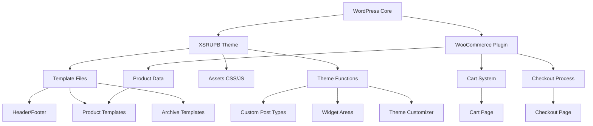
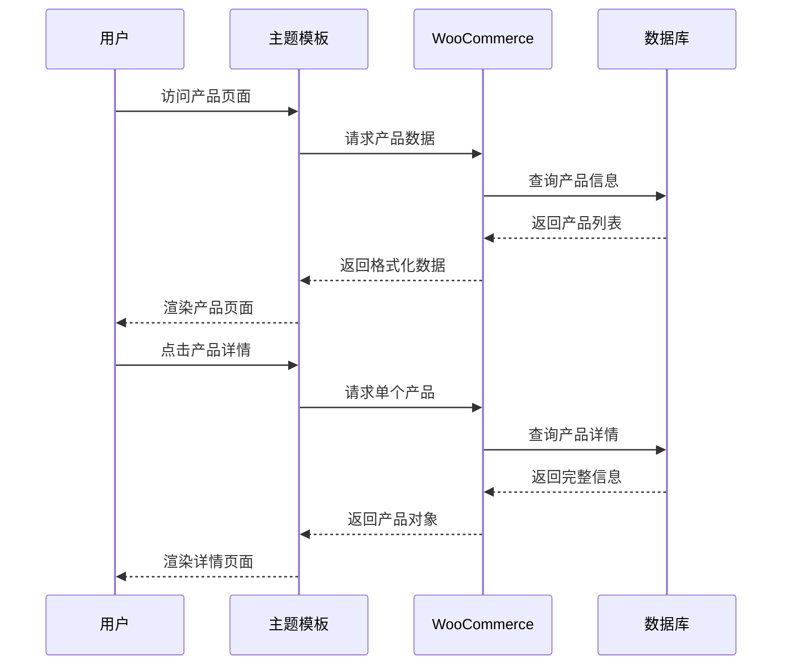
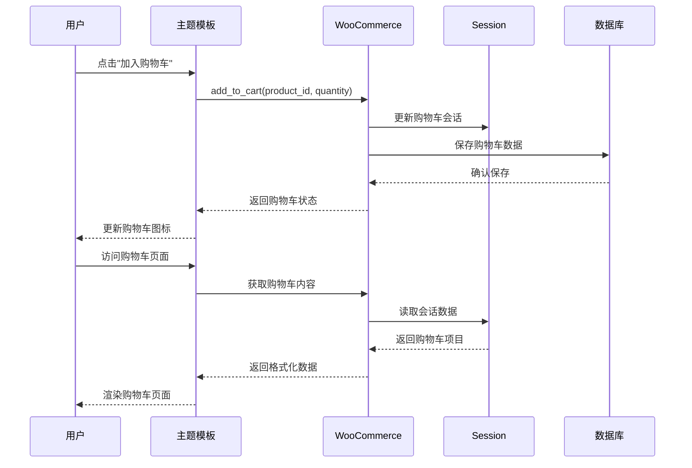

# 设计文档：XSRUPB WordPress 主题

## 概述

XSRUPB 是一个专为电子产品商城设计的 WordPress 主题，集成 WooCommerce 电商功能。主题基于原型图设计，提供完整的电商体验，包括首页展示、产品分类浏览、产品详情展示、购物车管理等核心功能。所有商品数据通过 WooCommerce 后台管理，前端动态渲染。主题采用响应式设计，支持多设备访问。

技术栈：WordPress 6.x + WooCommerce 8.x + PHP 8.0+ + MySQL 8.0

## 架构设计



## 序列图

### 产品浏览流程




### 购物车操作流程



## 组件和接口

### 组件 1：主题初始化器（Theme Initializer）

**目的**：初始化主题功能、注册钩子、加载资源

**接口**：
```php
class XSRUPB_Theme_Init {
    public function __construct();
    public function setup_theme(): void;
    public function register_menus(): void;
    public function register_sidebars(): void;
    public function enqueue_scripts(): void;
    public function enqueue_styles(): void;
}
```

**职责**：
- 注册主题支持功能（缩略图、标题标签、自定义 Logo 等）
- 注册导航菜单位置
- 注册小工具区域
- 加载 CSS 和 JavaScript 资源
- 设置内容宽度和图片尺寸


### 组件 2：WooCommerce 集成器（WooCommerce Integrator）

**目的**：自定义 WooCommerce 模板和功能

**接口**：
```php
class XSRUPB_WooCommerce_Integration {
    public function __construct();
    public function customize_product_loop(): void;
    public function customize_single_product(): void;
    public function customize_cart_page(): void;
    public function modify_product_query(WP_Query $query): WP_Query;
    public function add_custom_product_fields(): void;
    public function get_product_categories(): array;
}
```

**职责**：
- 覆盖 WooCommerce 默认模板
- 自定义产品循环显示
- 修改购物车页面布局
- 添加自定义产品字段
- 处理产品分类显示

### 组件 3：模板渲染器（Template Renderer）

**目的**：渲染主题模板和组件

**接口**：
```php
class XSRUPB_Template_Renderer {
    public function render_header(): void;
    public function render_footer(): void;
    public function render_navigation(): void;
    public function render_product_card(WC_Product $product): string;
    public function render_carousel(array $slides): string;
    public function render_breadcrumb(): string;
    public function get_template_part(string $slug, string $name = ''): void;
}
```

**职责**：
- 渲染页眉和页脚
- 渲染导航菜单
- 生成产品卡片 HTML
- 渲染轮播图组件
- 生成面包屑导航
- 加载模板片段


### 组件 4：资源管理器（Asset Manager）

**目的**：管理主题静态资源

**接口**：
```php
class XSRUPB_Asset_Manager {
    public function __construct();
    public function register_styles(): void;
    public function register_scripts(): void;
    public function enqueue_frontend_assets(): void;
    public function enqueue_admin_assets(): void;
    public function localize_script_data(): array;
}
```

**职责**：
- 注册和加载 CSS 文件
- 注册和加载 JavaScript 文件
- 管理前端资源依赖
- 传递 PHP 数据到 JavaScript
- 优化资源加载顺序

### 组件 5：AJAX 处理器（AJAX Handler）

**目的**：处理前端 AJAX 请求

**接口**：
```php
class XSRUPB_AJAX_Handler {
    public function __construct();
    public function register_ajax_actions(): void;
    public function handle_add_to_cart(): void;
    public function handle_update_cart(): void;
    public function handle_product_search(): void;
    public function handle_quick_view(): void;
    public function send_json_response(bool $success, mixed $data): void;
}
```

**职责**：
- 注册 AJAX 动作钩子
- 处理购物车操作
- 处理产品搜索请求
- 处理快速查看功能
- 返回 JSON 响应


## 数据模型

### 模型 1：主题配置（Theme Configuration）

```php
interface ThemeConfig {
    string $theme_name;
    string $theme_version;
    array $supported_features;
    array $menu_locations;
    array $sidebar_areas;
    array $image_sizes;
}
```

**验证规则**：
- theme_name 必须非空字符串
- theme_version 必须符合语义化版本格式
- supported_features 必须是有效的 WordPress 功能数组
- menu_locations 至少包含一个菜单位置
- image_sizes 必须包含宽度和高度

### 模型 2：产品数据（Product Data）

```php
interface ProductData {
    int $id;
    string $name;
    string $description;
    float $price;
    float $sale_price;
    string $sku;
    array $categories;
    array $images;
    string $stock_status;
    int $stock_quantity;
    array $attributes;
}
```

**验证规则**：
- id 必须是正整数
- name 必须非空字符串
- price 必须是非负数
- sale_price 如果存在必须小于 price
- sku 必须是唯一标识符
- stock_status 必须是 'instock', 'outofstock', 'onbackorder' 之一
- images 至少包含一张图片


### 模型 3：购物车项目（Cart Item）

```php
interface CartItem {
    int $product_id;
    int $variation_id;
    int $quantity;
    array $variation_data;
    float $line_subtotal;
    float $line_total;
    string $product_name;
    string $product_image;
}
```

**验证规则**：
- product_id 必须是有效的产品 ID
- quantity 必须是正整数
- line_subtotal 和 line_total 必须是非负数
- product_name 必须非空
- variation_data 如果是变体产品必须包含变体信息

### 模型 4：导航菜单项（Menu Item）

```php
interface MenuItem {
    int $id;
    string $title;
    string $url;
    int $parent_id;
    int $menu_order;
    array $children;
    string $target;
    array $classes;
}
```

**验证规则**：
- id 必须是正整数
- title 必须非空字符串
- url 必须是有效的 URL 或相对路径
- parent_id 为 0 表示顶级菜单项
- menu_order 用于排序，必须是非负整数
- target 必须是 '_self', '_blank', '_parent', '_top' 之一


## 算法伪代码

### 主处理算法：产品列表渲染

```php
/**
 * 算法：渲染产品列表页面
 * 输入：category_id (分类ID), page (页码), per_page (每页数量)
 * 输出：HTML 字符串
 */
function renderProductArchive(int $category_id, int $page, int $per_page): string
{
    // 前置条件
    ASSERT $category_id >= 0
    ASSERT $page > 0
    ASSERT $per_page > 0 AND $per_page <= 100
    
    // 步骤 1: 构建查询参数
    $args = [
        'post_type' => 'product',
        'posts_per_page' => $per_page,
        'paged' => $page,
        'post_status' => 'publish',
        'tax_query' => []
    ];
    
    // 步骤 2: 如果指定分类，添加分类过滤
    IF $category_id > 0 THEN
        $args['tax_query'][] = [
            'taxonomy' => 'product_cat',
            'field' => 'term_id',
            'terms' => $category_id
        ];
    END IF
    
    // 步骤 3: 执行查询
    $query = new WP_Query($args);
    
    // 步骤 4: 初始化输出
    $output = '';
    
    // 步骤 5: 遍历产品并渲染
    IF $query->have_posts() THEN
        $output .= '<div class="product-grid">';
        
        WHILE $query->have_posts() DO
            $query->the_post();
            $product = wc_get_product(get_the_ID());
            
            // 循环不变式：所有已处理的产品都已正确渲染
            ASSERT $product instanceof WC_Product
            
            $output .= renderProductCard($product);
        END WHILE
        
        $output .= '</div>';
        
        // 步骤 6: 添加分页
        $output .= renderPagination($query);
    ELSE
        $output = '<p class="no-products">暂无产品</p>';
    END IF
    
    // 重置查询
    wp_reset_postdata();
    
    // 后置条件
    ASSERT strlen($output) > 0
    
    RETURN $output;
}
```

**前置条件**：
- category_id 是非负整数（0 表示所有分类）
- page 是正整数
- per_page 在合理范围内（1-100）
- WooCommerce 插件已激活

**后置条件**：
- 返回有效的 HTML 字符串
- 如果有产品，包含产品网格和分页
- 如果无产品，显示提示信息
- WordPress 查询已重置

**循环不变式**：
- 每次迭代后，所有已处理的产品都已正确渲染为 HTML
- 产品对象始终是有效的 WC_Product 实例


### 验证算法：购物车数据验证

```php
/**
 * 算法：验证购物车项目数据
 * 输入：cart_item_data (购物车项目数据数组)
 * 输出：boolean (是否有效)
 */
function validateCartItem(array $cart_item_data): bool
{
    // 前置条件
    ASSERT is_array($cart_item_data)
    
    // 步骤 1: 检查必需字段
    $required_fields = ['product_id', 'quantity'];
    
    FOREACH $required_fields AS $field DO
        IF NOT isset($cart_item_data[$field]) THEN
            RETURN false;
        END IF
    END FOREACH
    
    // 步骤 2: 验证产品 ID
    $product_id = (int) $cart_item_data['product_id'];
    
    IF $product_id <= 0 THEN
        RETURN false;
    END IF
    
    $product = wc_get_product($product_id);
    
    IF $product === false OR $product === null THEN
        RETURN false;
    END IF
    
    // 步骤 3: 验证数量
    $quantity = (int) $cart_item_data['quantity'];
    
    IF $quantity <= 0 THEN
        RETURN false;
    END IF
    
    // 步骤 4: 检查库存
    IF NOT $product->is_in_stock() THEN
        RETURN false;
    END IF
    
    IF $product->managing_stock() THEN
        $stock_quantity = $product->get_stock_quantity();
        
        IF $quantity > $stock_quantity THEN
            RETURN false;
        END IF
    END IF
    
    // 步骤 5: 验证变体（如果是变体产品）
    IF isset($cart_item_data['variation_id']) THEN
        $variation_id = (int) $cart_item_data['variation_id'];
        
        IF $variation_id > 0 THEN
            $variation = wc_get_product($variation_id);
            
            IF $variation === false OR NOT $variation->is_type('variation') THEN
                RETURN false;
            END IF
        END IF
    END IF
    
    // 所有验证通过
    RETURN true;
}
```

**前置条件**：
- cart_item_data 是数组类型
- WooCommerce 已加载

**后置条件**：
- 返回布尔值表示验证结果
- true 当且仅当所有验证规则通过
- 不修改输入参数

**循环不变式**：
- 遍历必需字段时，所有已检查的字段都存在


## 关键函数与形式化规范

### 函数 1：setup_theme()

```php
function setup_theme(): void
```

**前置条件**：
- WordPress 核心已加载
- 主题目录存在且可读
- functions.php 正在执行

**后置条件**：
- 所有主题功能已注册（post-thumbnails, title-tag, custom-logo 等）
- 导航菜单位置已注册
- 内容宽度已设置
- 图片尺寸已定义
- 文本域已加载

**循环不变式**：N/A（无循环）

### 函数 2：enqueue_scripts()

```php
function enqueue_scripts(): void
```

**前置条件**：
- WordPress 已初始化
- wp_enqueue_scripts 钩子已触发
- 主题资源文件存在

**后置条件**：
- 所有必需的 JavaScript 文件已加入队列
- 依赖关系正确设置
- 本地化数据已传递给脚本
- 脚本按正确顺序加载

**循环不变式**：N/A（无循环）

### 函数 3：render_product_card()

```php
function render_product_card(WC_Product $product): string
```

**前置条件**：
- $product 是有效的 WC_Product 实例
- $product 不为 null
- 产品数据完整（标题、价格、图片等）

**后置条件**：
- 返回有效的 HTML 字符串
- HTML 包含产品图片、标题、价格、购买按钮
- HTML 结构符合主题样式要求
- 不修改 $product 对象

**循环不变式**：N/A（无循环）


### 函数 4：handle_add_to_cart()

```php
function handle_add_to_cart(): void
```

**前置条件**：
- 请求是 AJAX 请求
- $_POST['product_id'] 存在且有效
- $_POST['quantity'] 存在且为正整数
- 用户会话已初始化
- WooCommerce 购物车已加载

**后置条件**：
- 如果验证通过，产品已添加到购物车
- 购物车会话已更新
- 返回 JSON 响应（成功或失败）
- 响应包含更新后的购物车数据
- 如果失败，返回错误信息

**循环不变式**：N/A（无循环）

### 函数 5：get_product_categories()

```php
function get_product_categories(): array
```

**前置条件**：
- WooCommerce 已激活
- product_cat 分类法已注册
- 数据库连接正常

**后置条件**：
- 返回产品分类数组
- 每个分类包含 id, name, slug, parent, count
- 分类按层级结构组织
- 空分类可选择性包含或排除
- 数组不为 null

**循环不变式**：
- 遍历分类时，所有已处理的分类都包含完整信息


## 示例用法

### 示例 1：基本主题初始化

```php
// 在 functions.php 中
require_once get_template_directory() . '/inc/class-theme-init.php';

// 初始化主题
$theme = new XSRUPB_Theme_Init();

// 注册主题功能
add_action('after_setup_theme', [$theme, 'setup_theme']);

// 加载资源
add_action('wp_enqueue_scripts', [$theme, 'enqueue_scripts']);
add_action('wp_enqueue_scripts', [$theme, 'enqueue_styles']);
```

### 示例 2：渲染产品列表

```php
// 在 archive-product.php 模板中
<?php
get_header();

// 获取当前分类
$current_category = get_queried_object();
$category_id = $current_category ? $current_category->term_id : 0;

// 渲染产品列表
$renderer = new XSRUPB_Template_Renderer();
echo renderProductArchive($category_id, get_query_var('paged', 1), 12);

get_footer();
?>
```

### 示例 3：AJAX 添加到购物车

```php
// JavaScript 端
jQuery('.add-to-cart-btn').on('click', function(e) {
    e.preventDefault();
    
    const productId = $(this).data('product-id');
    const quantity = $(this).closest('.product-card').find('.qty-input').val();
    
    $.ajax({
        url: xsrupb_ajax.ajax_url,
        type: 'POST',
        data: {
            action: 'xsrupb_add_to_cart',
            product_id: productId,
            quantity: quantity,
            nonce: xsrupb_ajax.nonce
        },
        success: function(response) {
            if (response.success) {
                // 更新购物车图标
                $('.cart-badge').text(response.data.cart_count);
                $('.cart-total').text(response.data.cart_total);
                
                // 显示成功消息
                alert('产品已添加到购物车');
            } else {
                alert('添加失败：' + response.data.message);
            }
        }
    });
});

// PHP 端（在 AJAX Handler 中）
public function handle_add_to_cart(): void
{
    // 验证 nonce
    check_ajax_referer('xsrupb_nonce', 'nonce');
    
    // 获取并验证数据
    $product_id = isset($_POST['product_id']) ? absint($_POST['product_id']) : 0;
    $quantity = isset($_POST['quantity']) ? absint($_POST['quantity']) : 1;
    
    $cart_item_data = [
        'product_id' => $product_id,
        'quantity' => $quantity
    ];
    
    // 验证购物车项目
    if (!validateCartItem($cart_item_data)) {
        wp_send_json_error(['message' => '无效的产品数据']);
        return;
    }
    
    // 添加到购物车
    $cart_item_key = WC()->cart->add_to_cart($product_id, $quantity);
    
    if ($cart_item_key) {
        wp_send_json_success([
            'cart_count' => WC()->cart->get_cart_contents_count(),
            'cart_total' => WC()->cart->get_cart_total()
        ]);
    } else {
        wp_send_json_error(['message' => '添加到购物车失败']);
    }
}
```


### 示例 4：自定义 WooCommerce 模板

```php
// 在 woocommerce/content-product.php 中
<?php
defined('ABSPATH') || exit;

global $product;

// 确保产品对象有效
if (empty($product) || !$product->is_visible()) {
    return;
}
?>

<div class="product-card" data-product-id="<?php echo esc_attr($product->get_id()); ?>">
    <div class="product-img">
        <?php echo $product->get_image('medium'); ?>
        
        <?php if ($product->is_on_sale()) : ?>
            <span class="badge badge-sale">SALE</span>
        <?php elseif ($product->is_featured()) : ?>
            <span class="badge badge-hot">HOT</span>
        <?php endif; ?>
    </div>
    
    <h3><?php echo esc_html($product->get_name()); ?></h3>
    
    <p class="product-desc">
        <?php echo wp_trim_words($product->get_short_description(), 10); ?>
    </p>
    
    <div class="product-footer">
        <p class="product-price"><?php echo $product->get_price_html(); ?></p>
        
        <button class="buy-btn add-to-cart-btn" 
                data-product-id="<?php echo esc_attr($product->get_id()); ?>">
            <?php echo esc_html__('购买', 'xsrupb'); ?>
        </button>
    </div>
</div>
```

### 示例 5：完整的产品查询工作流

```php
// 获取特定分类的产品
function get_category_products(int $category_id, int $limit = 10): array
{
    // 前置条件验证
    if ($category_id <= 0 || $limit <= 0) {
        return [];
    }
    
    // 构建查询
    $args = [
        'post_type' => 'product',
        'posts_per_page' => $limit,
        'post_status' => 'publish',
        'tax_query' => [
            [
                'taxonomy' => 'product_cat',
                'field' => 'term_id',
                'terms' => $category_id
            ]
        ]
    ];
    
    $query = new WP_Query($args);
    $products = [];
    
    if ($query->have_posts()) {
        while ($query->have_posts()) {
            $query->the_post();
            $product = wc_get_product(get_the_ID());
            
            if ($product && $product->is_visible()) {
                $products[] = [
                    'id' => $product->get_id(),
                    'name' => $product->get_name(),
                    'price' => $product->get_price(),
                    'image' => wp_get_attachment_url($product->get_image_id()),
                    'url' => get_permalink($product->get_id())
                ];
            }
        }
        wp_reset_postdata();
    }
    
    return $products;
}
```


## 正确性属性

*属性是一个特征或行为，应该在系统的所有有效执行中保持为真——本质上是关于系统应该做什么的形式化陈述。属性作为人类可读规范和机器可验证正确性保证之间的桥梁。*

### 属性 1：主题功能注册完整性

*对于任何* 主题激活操作，主题初始化后必须注册所有必需的 WordPress 功能支持（post-thumbnails, title-tag, custom-logo, html5），至少一个导航菜单位置，至少一个小工具区域，并设置内容宽度和图片尺寸。

**验证需求：1.1, 1.2, 1.3, 1.4**

### 属性 2：资源依赖顺序正确性

*对于任何* 注册的脚本，如果该脚本声明了依赖项，则所有依赖项必须在该脚本之前加载。

**验证需求：2.3**

### 属性 3：AJAX 本地化数据完整性

*对于任何* 需要 AJAX 功能的页面，Asset_Manager 必须将 AJAX URL 和有效的 nonce 令牌传递给前端脚本。

**验证需求：2.4**

### 属性 4：已发布产品数据完整性

*对于任何* 已发布的产品，该产品必须包含非空的名称、有效的价格和至少一张图片。

**验证需求：3.1, 17.1, 17.5**

### 属性 5：产品卡片渲染完整性

*对于任何* 产品对象，渲染产品卡片时生成的 HTML 必须包含产品图片、名称、价格和购买按钮。

**验证需求：3.2, 9.7**

### 属性 6：产品分类过滤正确性

*对于任何* 指定的产品分类 ID，查询该分类的产品列表时返回的所有产品必须属于该分类。

**验证需求：4.1**

### 属性 7：分类层级引用完整性

*对于任何* 产品分类，如果该分类有父分类（parent_id > 0），则父分类必须存在于系统中。

**验证需求：4.5, 17.4**

### 属性 8：购物车价格计算一致性

*对于任何* 购物车项目，该项目的总价必须等于产品单价乘以数量。

**验证需求：6.4, 17.3**

### 属性 9：购物车添加后计数更新

*对于任何* 成功添加到购物车的产品，购物车商品计数必须增加相应的数量。

**验证需求：6.2**

### 属性 10：购物车数据验证完整性

*对于任何* 添加到购物车的请求，系统必须验证产品 ID 有效、数量为正整数、产品有库存、数量不超过可用库存，如果是变体产品则验证变体 ID 有效，任何验证失败必须拒绝操作并返回错误信息。

**验证需求：7.1, 7.2, 7.3, 7.4, 7.5, 7.6**

### 属性 11：AJAX 响应格式一致性

*对于任何* AJAX 响应，响应必须包含 success 和 data 字段，且当 success 为 true 时 data 不能为 null。

**验证需求：8.2, 8.3, 8.4**

### 属性 12：AJAX 安全令牌验证

*对于任何* AJAX 请求，系统必须验证请求的 nonce 安全令牌，验证失败必须拒绝请求并返回安全错误。

**验证需求：8.1, 14.3**

### 属性 13：必需模板文件存在性

*对于任何* 必需的模板文件（header.php, footer.php, index.php, archive-product.php, single-product.php, cart.php），该文件必须存在于主题目录中且可读。

**验证需求：9.1, 9.2, 9.3, 9.4, 9.5, 9.6**

### 属性 14：产品搜索输入清理

*对于任何* 用户输入的搜索关键词，系统必须清理 HTML 标签和特殊字符，并限制长度不超过 100 个字符。

**验证需求：13.2, 13.5**

### 属性 15：输出转义安全性

*对于任何* 用户生成的内容输出，系统必须使用适当的转义函数（esc_html, esc_attr, esc_url）进行转义。

**验证需求：14.1**

### 属性 16：用户输入清理验证

*对于任何* 用户输入数据，系统必须在处理前进行清理和验证。

**验证需求：14.2**

### 属性 17：权限验证

*对于任何* 受限功能的访问请求，系统必须验证用户具有相应权限。

**验证需求：14.5**

### 属性 18：产品分类缓存使用

*对于任何* 产品分类数据查询，系统应该使用 WordPress transient API 进行缓存以提高性能。

**验证需求：15.1**

### 属性 19：静态资源版本号

*对于任何* 注册的静态资源（CSS/JS），系统必须设置版本号以支持浏览器缓存。

**验证需求：15.3**

### 属性 20：产品查询数量限制

*对于任何* 产品查询，系统必须设置合理的每页产品数量限制（不超过 100）。

**验证需求：15.5**

### 属性 21：错误日志记录

*对于任何* 系统错误，系统必须记录错误日志以便调试。

**验证需求：16.5**

### 属性 22：产品对象类型验证

*对于任何* 显示的产品，系统必须验证产品对象是有效的 WC_Product 实例。

**验证需求：17.2**

### 属性 23：多语言文本域加载

*对于任何* 主题初始化，系统必须加载主题文本域以支持多语言。

**验证需求：1.5, 18.1**

### 属性 24：翻译文件支持

*对于任何* 主题安装，系统必须提供 POT 翻译模板文件并支持从 languages 目录加载翻译文件。

**验证需求：18.3, 18.4**

## 错误处理

### 错误场景 1：产品不存在

**条件**：用户尝试访问不存在或已删除的产品

**响应**：
- 显示 404 页面
- 记录错误日志
- 提供返回产品列表的链接

**恢复**：
- 重定向到产品归档页面
- 显示相关产品推荐

### 错误场景 2：库存不足

**条件**：用户尝试添加超过库存数量的产品到购物车

**响应**：
- 阻止添加操作
- 显示错误消息："库存不足，当前可用数量：X"
- 自动调整数量为最大可用库存

**恢复**：
- 允许用户修改数量
- 提供"到货通知"选项


### 错误场景 3：AJAX 请求失败

**条件**：网络错误或服务器错误导致 AJAX 请求失败

**响应**：
- 捕获错误并显示用户友好的消息
- 记录详细错误信息到控制台
- 提供重试选项

**恢复**：
- 实现自动重试机制（最多 3 次）
- 如果持续失败，建议刷新页面

### 错误场景 4：无效的分类 ID

**条件**：URL 中包含无效或不存在的分类 ID

**响应**：
- 显示所有产品而不是特定分类
- 在面包屑中显示"所有产品"
- 记录警告日志

**恢复**：
- 自动回退到产品归档页面
- 显示分类导航帮助用户选择

### 错误场景 5：会话过期

**条件**：用户会话过期，购物车数据丢失

**响应**：
- 检测会话状态
- 显示提示："您的会话已过期，请重新登录"
- 尝试从 Cookie 恢复购物车数据

**恢复**：
- 重定向到登录页面
- 登录后恢复购物车内容
- 如果无法恢复，提供浏览历史

## 测试策略

### 单元测试方法

**测试范围**：
- 所有工具函数（验证、格式化、计算等）
- 数据模型验证逻辑
- AJAX 处理器的各个方法
- 模板渲染函数

**测试框架**：PHPUnit

**关键测试用例**：
1. 测试 `validateCartItem()` 函数的各种输入场景
2. 测试产品价格计算的准确性
3. 测试分类层级关系的正确性
4. 测试模板渲染输出的 HTML 有效性


### 属性测试方法

**测试范围**：
- 产品数据完整性属性
- 购物车一致性属性
- 价格计算属性
- 库存约束属性

**测试库**：使用 PHPUnit 的数据提供者功能模拟属性测试

**关键属性测试**：

1. **产品数据完整性测试**
   - 生成随机产品数据集
   - 验证所有已发布产品包含必需字段
   - 属性：`∀ product, product.published ⟹ product.valid`

2. **购物车价格一致性测试**
   - 生成随机购物车配置
   - 验证总价计算正确
   - 属性：`∀ cart, cart.total = sum(item.price × item.qty)`

3. **库存约束测试**
   - 生成各种库存场景
   - 验证不能添加超过库存的数量
   - 属性：`∀ cart_item, cart_item.qty ≤ product.stock`

4. **分类关系测试**
   - 生成分类树结构
   - 验证父子关系完整性
   - 属性：`∀ child, child.parent_id > 0 ⟹ parent_exists(child.parent_id)`

### 集成测试方法

**测试范围**：
- WordPress 主题与 WooCommerce 的集成
- 前端 JavaScript 与后端 PHP 的交互
- 数据库查询和数据持久化
- 完整的用户工作流

**测试环境**：
- 使用 WordPress 测试套件
- 配置测试数据库
- 模拟 WooCommerce 环境

**关键集成测试**：
1. 完整的产品浏览流程（从首页到产品详情）
2. 添加到购物车的完整流程
3. 购物车更新和结账流程
4. 产品搜索和过滤功能
5. 用户登录和会话管理


## 性能考虑

### 数据库查询优化

**策略**：
- 使用 WP_Query 的缓存机制
- 避免在循环中执行查询（N+1 问题）
- 使用 `posts_per_page` 限制查询结果
- 为产品分类和标签添加索引
- 使用对象缓存（Redis/Memcached）

**实现**：
```php
// 使用 transient 缓存产品分类
function get_cached_product_categories(): array
{
    $cache_key = 'xsrupb_product_categories';
    $categories = get_transient($cache_key);
    
    if (false === $categories) {
        $categories = get_terms([
            'taxonomy' => 'product_cat',
            'hide_empty' => true
        ]);
        
        set_transient($cache_key, $categories, HOUR_IN_SECONDS);
    }
    
    return $categories;
}
```

### 资源加载优化

**策略**：
- 合并和压缩 CSS/JS 文件
- 使用 CDN 加载第三方库
- 实现延迟加载（Lazy Loading）图片
- 使用 WebP 格式图片
- 启用浏览器缓存

**实现**：
```php
// 延迟加载非关键 JavaScript
function enqueue_scripts(): void
{
    wp_enqueue_script(
        'xsrupb-main',
        get_template_directory_uri() . '/assets/js/main.js',
        ['jquery'],
        '1.0.0',
        true // 在页脚加载
    );
    
    // 添加 defer 属性
    add_filter('script_loader_tag', function($tag, $handle) {
        if ('xsrupb-carousel' === $handle) {
            return str_replace(' src', ' defer src', $tag);
        }
        return $tag;
    }, 10, 2);
}
```

### 页面渲染优化

**策略**：
- 使用片段缓存（Fragment Caching）
- 实现 AJAX 分页减少页面重载
- 优化产品图片尺寸
- 减少 DOM 元素数量
- 使用 CSS 动画代替 JavaScript

**目标性能指标**：
- 首次内容绘制（FCP）< 1.5 秒
- 最大内容绘制（LCP）< 2.5 秒
- 首次输入延迟（FID）< 100 毫秒
- 累积布局偏移（CLS）< 0.1


## 安全考虑

### 输入验证和清理

**策略**：
- 验证所有用户输入
- 使用 WordPress 清理函数
- 实施白名单验证
- 防止 SQL 注入
- 防止 XSS 攻击

**实现**：
```php
// 清理和验证产品搜索输入
function sanitize_product_search(string $search_term): string
{
    // 移除 HTML 标签
    $search_term = wp_strip_all_tags($search_term);
    
    // 清理特殊字符
    $search_term = sanitize_text_field($search_term);
    
    // 限制长度
    $search_term = substr($search_term, 0, 100);
    
    return $search_term;
}

// 验证 AJAX 请求
function handle_ajax_request(): void
{
    // 验证 nonce
    if (!check_ajax_referer('xsrupb_nonce', 'nonce', false)) {
        wp_send_json_error(['message' => '安全验证失败']);
        return;
    }
    
    // 验证用户权限
    if (!current_user_can('read')) {
        wp_send_json_error(['message' => '权限不足']);
        return;
    }
    
    // 处理请求...
}
```

### 数据输出转义

**策略**：
- 使用 `esc_html()` 转义 HTML 内容
- 使用 `esc_attr()` 转义属性值
- 使用 `esc_url()` 转义 URL
- 使用 `wp_kses()` 允许特定 HTML 标签

**实现**：
```php
// 安全输出产品信息
<h3><?php echo esc_html($product->get_name()); ?></h3>
<a href="<?php echo esc_url($product->get_permalink()); ?>">
    get_image_url()); ?>" 
         alt="<?php echo esc_attr($product->get_name()); ?>">
</a>
```

### 权限控制

**策略**：
- 检查用户权限
- 实施角色基础访问控制
- 保护管理功能
- 验证产品所有权

**实现**：
```php
// 检查用户是否可以编辑产品
function can_edit_product(int $product_id): bool
{
    if (!is_user_logged_in()) {
        return false;
    }
    
    $product = wc_get_product($product_id);
    
    if (!$product) {
        return false;
    }
    
    return current_user_can('edit_product', $product_id);
}
```

### 安全威胁防护

**防护措施**：
- CSRF 保护（使用 nonce）
- SQL 注入防护（使用预处理语句）
- XSS 防护（输出转义）
- 文件上传验证
- 速率限制（防止暴力攻击）


## 依赖项

### WordPress 核心依赖

**版本要求**：
- WordPress 6.0 或更高版本
- PHP 8.0 或更高版本
- MySQL 8.0 或 MariaDB 10.5 或更高版本

**核心功能依赖**：
- Post Thumbnails（特色图片）
- Custom Logo（自定义 Logo）
- Title Tag（标题标签）
- HTML5 支持
- Widgets（小工具）
- Navigation Menus（导航菜单）

### 插件依赖

**必需插件**：
- WooCommerce 8.0+（电商核心功能）

**推荐插件**：
- WooCommerce Multilingual（多语言支持）
- YITH WooCommerce Wishlist（愿望清单）
- WooCommerce PDF Invoices（发票生成）
- Contact Form 7（联系表单）

### 前端库依赖

**JavaScript 库**：
- jQuery 3.6+（WordPress 自带）
- Swiper.js 8.0+（轮播图）
- Select2 4.0+（下拉选择增强）

**CSS 框架**：
- 自定义 CSS（不依赖外部框架）
- 使用 CSS Grid 和 Flexbox 布局

### 开发工具依赖

**构建工具**：
- Node.js 16+
- npm 或 yarn
- Webpack 5+（可选，用于资源打包）
- Sass（CSS 预处理器）

**代码质量工具**：
- PHP_CodeSniffer（代码规范检查）
- WordPress Coding Standards
- ESLint（JavaScript 代码检查）
- Stylelint（CSS 代码检查）

### 服务器环境要求

**Web 服务器**：
- Apache 2.4+ 或 Nginx 1.18+
- mod_rewrite 模块（Apache）

**PHP 扩展**：
- mysqli 或 pdo_mysql
- gd 或 imagick（图片处理）
- mbstring（多字节字符串）
- xml
- zip
- curl

**推荐配置**：
- memory_limit: 256M 或更高
- max_execution_time: 300
- upload_max_filesize: 64M
- post_max_size: 64M

### 第三方服务（可选）

**CDN 服务**：
- Cloudflare
- Amazon CloudFront

**支付网关**：
- PayPal
- Stripe
- 支付宝
- 微信支付

**邮件服务**：
- SendGrid
- Mailgun
- Amazon SES

## 主题文件结构

```
xsrupb-theme/
├── style.css                 # 主题样式表（必需）
├── functions.php             # 主题函数文件（必需）
├── index.php                 # 主模板（必需）
├── header.php                # 页眉模板
├── footer.php                # 页脚模板
├── sidebar.php               # 侧边栏模板
├── screenshot.png            # 主题截图
├── readme.txt                # 主题说明
│
├── assets/                   # 静态资源
│   ├── css/
│   │   ├── main.css
│   │   ├── woocommerce.css
│   │   └── responsive.css
│   ├── js/
│   │   ├── main.js
│   │   ├── carousel.js
│   │   └── cart.js
│   └── images/
│       └── logo.png
│
├── inc/                      # PHP 类和函数
│   ├── class-theme-init.php
│   ├── class-woocommerce-integration.php
│   ├── class-template-renderer.php
│   ├── class-asset-manager.php
│   └── class-ajax-handler.php
│
├── template-parts/           # 模板片段
│   ├── content-product.php
│   ├── content-none.php
│   └── navigation.php
│
├── woocommerce/              # WooCommerce 模板覆盖
│   ├── archive-product.php
│   ├── single-product.php
│   ├── cart/
│   │   └── cart.php
│   └── content-product.php
│
└── languages/                # 翻译文件
    ├── xsrupb.pot
    └── zh_CN.po
```

## 总结

XSRUPB WordPress 主题是一个功能完整的电商主题，专为电子产品商城设计。主题深度集成 WooCommerce，提供产品展示、分类浏览、购物车管理等核心电商功能。设计遵循 WordPress 和 WooCommerce 最佳实践，注重性能优化、安全性和可维护性。所有产品数据通过 WooCommerce 后台管理，前端动态渲染，支持响应式设计和多设备访问。
